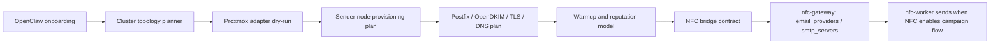

# Fase 4: OpenClaw MVP e integracion NFC

Fecha: 2026-05-02

Documento rector: `NORTE_OPERATIVO_DELIVRIX.md`.

Resumen: Fase 4 construye OpenClaw, onboarding inteligente, topology planner y bridge NFC en modo seguro. No activa envio real desde Delivrix.

## Contexto

Despues de cerrar Fase 3, se revisaron como referencia local los tres repositorios privados del sistema NFC:

- `National-Filing-Corporation/nfc-gateway`
- `National-Filing-Corporation/nfc-worker`
- `National-Filing-Corporation/nfc-frontend`

Los repos fueron clonados en `clonado/`, carpeta ignorada por Git. Esta carpeta es solo material de referencia y no forma parte del producto Delivrix.

## Correccion de alcance

La Fase 4 no debe interpretarse como "Delivrix reemplaza el sistema que envia emails".

El sistema NFC ya tiene un gateway, un worker y un frontend que administran campanas, proveedores, colas, registros de email, webhooks y envio real. Por tanto, el alcance inmediato de Delivrix/OpenClaw es:

1. onboarding inteligente para configurar infraestructura propia;
2. planificacion de clusters/VPS sobre servidor fisico y Proxmox;
3. preparacion de sender nodes con Postfix, OpenDKIM, TLS, DNS rutinario y warming;
4. monitoreo de reputacion, colas, bounces, complaints y blacklists;
5. bridge/API para registrar o sincronizar capacidad hacia NFC cuando sea seguro.

Delivrix no debe enviar correo real por su cuenta en esta fase. NFC sigue siendo el motor de envio. Delivrix aporta infraestructura, control operativo, auditoria y automatizacion segura.

## Mapa funcional de NFC

### `nfc-gateway`

Responsabilidades observadas:

- API principal NestJS.
- Autenticacion, roles, dashboard, campanas, templates, negocios, ordenes y pagos.
- Administracion de `email_providers`.
- Administracion de `smtp_servers`.
- Importacion de buzones tipo Infraforge.
- Webhooks de pagos, SparkPost, Postfix bounces e inbound bounces.
- Health checks, blacklist checks, warmup y bounce-rate reports.

Puntos de integracion relevantes:

- `email_providers`: representa capacidad de envio disponible para el worker.
- `smtp_servers`: inventario de VPS SMTP asociado opcionalmente a providers.
- `infraforge_mailboxes`: buzones SMTP importados y asociados a un provider.
- `webhooks/postfix-bounces`: entrada para bounces reportados desde VPS.
- `email-providers/import-infraforge`: referencia de importacion de capacidad SMTP.

### `nfc-worker`

Responsabilidades observadas:

- Procesa la cola `email-sending`.
- Carga providers activos desde base de datos.
- Usa adaptadores para SendGrid, Resend, SparkPost, ElasticEmail, Mailgun, Mailtrap y SMTP.
- Usa Redis para conteo diario y rate limit compartido por provider.
- En modo `log`, no envia emails reales.
- En modo `email`, envia por el adaptador configurado.

Puntos de integracion relevantes:

- El provider SMTP requiere credenciales y limites correctos.
- El worker respeta `dailyLimit` y rate limit por provider.
- El worker actualiza estados en `email_registries`.
- La capacidad creada por Delivrix debe entrar como providers/SMTP servers compatibles con el contrato NFC.

### `nfc-frontend`

Responsabilidades observadas:

- Frontend publico Next.js.
- Landing, signup, renew, payment, unsubscribe y paginas legales.
- No es el primer punto de integracion para OpenClaw.

## Frontera de integracion propuesta

Regla central: Delivrix/OpenClaw crea y gobierna capacidad; NFC decide y ejecuta el envio dentro de su pipeline actual.

## Riesgos encontrados

### 1. Posibles secretos en repos de referencia

Durante la lectura aparecieron indicios de credenciales o strings sensibles en documentacion interna de repos NFC. No se deben copiar a esta documentacion ni al repo Delivrix.

Accion recomendada:

- revisar si son secretos reales;
- rotarlos si aplican;
- removerlos del repo y, si es necesario, del historial;
- mover configuracion a variables de entorno o secret manager.

### 2. Contrato `email_providers` no esta 100% alineado

Se observo una migracion en gateway que elimina `workerInstanceId` de `email_providers`, mientras el worker todavia declara ese campo en su entidad.

Riesgo:

- fallos en runtime si el worker espera una columna que ya no existe;
- errores silenciosos al cargar providers;
- dificultad para que Delivrix registre capacidad compatible.

Accion recomendada:

- validar esquema real de base de datos;
- alinear entidades gateway/worker;
- documentar version estable del contrato antes de construir el bridge.

### 3. Acciones SSH de alto impacto existen en NFC

NFC tiene servicios capaces de consultar colas SMTP por SSH y tambien acciones como flush/purge de colas.

Regla Delivrix:

- OpenClaw no debe llamar acciones destructivas o de alto impacto sin aprobacion humana;
- en Fase 4 todo debe iniciar en read-only o dry-run;
- cualquier accion real debe quedar auditada, verificada y con rollback cuando aplique.

### 4. Fallback de credenciales SMTP sin cifrar

El worker tiene compatibilidad para parsear credenciales SMTP en JSON plano como fallback.

Riesgo:

- exposicion de secretos;
- drift entre entornos;
- mala practica para produccion.

Accion recomendada:

- exigir credenciales cifradas;
- bloquear fallback plano en produccion;
- registrar auditoria cuando una configuracion insegura sea detectada.

## Hitos Fase 4

### Hito 4.1: Contrato NFC read-only

Objetivo:

- documentar el contrato estable entre Delivrix y NFC.

Entregables:

- inventario de tablas/endpoints NFC relevantes;
- mapa de campos para `email_providers`, `smtp_servers`, capacidad, limites y reputacion;
- validacion de mismatch `workerInstanceId`;
- decision de integracion: API NFC primero, DB directa solo si no hay endpoint seguro.

Gate:

- no escribir en NFC hasta tener contrato revisado.

### Hito 4.2: Onboarding inteligente OpenClaw

Objetivo:

- crear un flujo guiado para describir servidor fisico, IPs, dominios, DNS, limites, warming y permisos.

Entregables:

- schema de onboarding;
- validadores de entrada;
- snapshot auditable de decisiones;
- modo simulacion.

Gate:

- no aceptar datos incompletos para infraestructura real.

### Hito 4.3: Cluster topology planner

Objetivo:

- convertir el onboarding en un plan de clusters/VPS/LXC.

Entregables:

- calculo de nodos por capacidad;
- asignacion de IP/dominio;
- limites iniciales por node/provider;
- plan de DNS/Postfix/OpenDKIM/TLS;
- recomendaciones de warming.

Gate:

- el plan debe explicar riesgos y no prometer volumen sin reputacion saludable.

### Hito 4.4: OpenClaw scheduler y skills en read-only

Objetivo:

- construir el esqueleto de OpenClaw sin efectos reales.

Entregables:

- scheduler;
- skills `fleet-ops`, `alert-ops`, `report-ops`;
- LLM router con modo degradado sin LLM;
- reportes diarios simulados;
- audit log para cada decision.

Gate:

- OpenClaw primero observa y reporta.

### Hito 4.5: Action executor dry-run

Objetivo:

- preparar el ejecutor de acciones sin tocar Proxmox, SSH, DNS, SMTP ni NFC real.

Entregables:

- action plan;
- dry-run obligatorio;
- verificacion post-ejecucion simulada;
- rollback plan para acciones reversibles;
- presupuesto diario de IA.

Gate:

- ninguna accion real sin modo supervised y aprobacion humana.

### Hito 4.6: NFC bridge draft

Objetivo:

- generar payloads compatibles para registrar capacidad provisionada en NFC.

Entregables:

- adapter `NfcBridge` en modo mock;
- payload para provider SMTP;
- payload para SMTP server;
- mapeo de health/reputation hacia estados NFC;
- prueba local sin llamadas externas.

Gate:

- bridge no envia correos ni activa providers reales.

### Hito 4.7: Runbook, seguridad y Go/No-Go

Objetivo:

- cerrar Fase 4 con criterios operativos claros.

Entregables:

- runbook OpenClaw;
- matriz de permisos;
- kill switch probado;
- checklist de secretos;
- checklist de contrato NFC;
- lista de acciones permitidas, supervisadas y prohibidas.

Gate:

- no pasar a Fase 5 si no hay auditoria, dry-run, kill switch y contrato NFC alineado.

## Acciones permitidas en Fase 4

- Leer inventario local y simulado.
- Generar planes de provisioning.
- Generar reportes.
- Detectar riesgos.
- Proponer cambios.
- Simular acciones.
- Registrar auditoria.

## Acciones prohibidas en Fase 4 sin aprobacion explicita

- Crear o destruir VPS reales.
- Conectarse por SSH a servidores productivos.
- Modificar DNS real.
- Activar SMTP real.
- Enviar emails.
- Purgar colas.
- Rotar IPs para sostener volumen.
- Escribir en repos o bases NFC sin autorizacion.
- Subir secretos al repo.

## Criterio de salida

Fase 4 queda lista cuando:

- OpenClaw opera en read-only/dry-run.
- Existe onboarding inteligente y planner de clusters.
- Existe contrato NFC documentado.
- Existe bridge mock compatible.
- El sistema registra auditoria para decisiones y acciones.
- El kill switch esta probado.
- Los riesgos de secretos y mismatch de esquema quedan tratados o bloqueados por gate.
