# Índice de documentación · Delivrix

> Última actualización: **2026-05-19** · Día **21/30** del MVP
> Hito activo: **5.11.B — OpenClaw Hostinger Agent** (13/14 milestones cerrados)
> Próximo hito: **5.12 — Multi-provider inventory MVP** (arranca D+8 si 5.11.B cierra limpio)

## Estado rápido

| Hito | Status | Milestones | Notas |
|------|--------|-----------|-------|
| 4.x | ✅ done | 5 docs conceptuales | Onboarding + topology + provisioning + scheduler + permisos |
| 5.0–5.9 | ✅ done | 10 docs conceptuales | Demo blueprint + panel admin + canvas + collector + ingesta |
| 5.10 | ✅ done | Fase A–H.23 | Frontend Pencil completo, en rama, no en main aún |
| 5.11.A | ✅ done | 6/6 | Webdock adapter + drift detection |
| **5.11.B** | 🔄 in progress | 13/14 | D+6 PM re-smoke verde, D+7 cierre formal pendiente |
| 5.12 | 📝 spec only | 0/8 | Multi-provider inventory MVP, días 27-30 |
| 5.13 | 📝 spec only | post-MVP | Multi-provider completion (IONOS robusto, secret manager, writes proposal) |

## Roadmap visual

```mermaid
flowchart TB
    classDef done fill:#1e3a2e,stroke:#22c55e,color:#86efac
    classDef active fill:#3a2d0c,stroke:#f59e0b,color:#fbbf24
    classDef pending fill:#1f2937,stroke:#4b5563,color:#9ca3af
    classDef post fill:#1e1b3a,stroke:#8b5cf6,color:#c4b5fd

    subgraph F["Fundación · días 1-20"]
        H510["Hito 5.10 · Frontend Pencil"]:::done
        H511A["Hito 5.11.A · Webdock adapter"]:::done
    end

    subgraph A["Hito 5.11.B · OpenClaw Agent · días 17-23"]
        direction TB
        D1["D+1 OpenClaw básico + system prompt"]:::done
        D2["D+2 KB ChromaDB + 2 skills iniciales"]:::done
        D3["D+3 alert-ops + drift-monitor"]:::done
        D4["D+4 HMAC + ApprovalToken + report-ops"]:::done
        D5["D+5 hash chain SHA-256 + 3 runbooks"]:::done
        D6AM["D+6 AM quarantine + business hours quorum"]:::done
        D6PM["D+6 PM smoke E2E verde"]:::done
        D7["D+7 cierre formal Hito 5.11.B"]:::pending
        D1 --> D2 --> D3 --> D4 --> D5 --> D6AM --> D6PM --> D7
    end

    subgraph I["Hito 5.12 · Multi-provider inventory MVP · días 24-27"]
        direction TB
        I8A["D+8 AM Webdock × 3 cuentas"]:::pending
        I8P["D+8 PM Provider abstraction + endpoint unificado"]:::pending
        I9A["D+9 AM AWS Route53 + Domains read"]:::pending
        I9P["D+9 PM Skill genérica + panel base + system context rebuild"]:::pending
        I10A["D+10 AM IONOS Cloud DNS adapter"]:::pending
        I10P["D+10 PM Panel drilldown + filtros"]:::pending
        I11["D+11 Smoke E2E operador + demo prep"]:::pending
        I8A --> I8P --> I9A --> I9P --> I10A --> I10P --> I11
    end

    subgraph D["Demo handoff · días 28-30"]
        DEMO["Release a main + demo guion + screenshots"]:::pending
    end

    subgraph P["Post-MVP · Hito 5.13+"]
        P1["IONOS Domains API legacy"]:::post
        P2["Secret manager (1Password / AWS Secrets)"]:::post
        P3["Cross-references entre proveedores"]:::post
        P4["Writes proposal con fase nueva + kill switch dedicado"]:::post
        P5["Notion reactivación cuando Workspace Owner"]:::post
        P6["OIDC real para operadores"]:::post
    end

    F --> A --> I --> D --> P
```

## Orden de lectura para nuevos colaboradores

1. `NORTE_OPERATIVO_DELIVRIX.md` — gates duros, valores no-negociables
2. `RESUMEN_RUTA_PROYECTO.md` — mapa técnico del sistema
3. `ROADMAP_PROYECTO.md` — fases por orden cronológico
4. `ESTANDARES_INGENIERIA.md` — convenciones de código
5. Este índice — punto de entrada
6. Doc del hito activo: `HITO_5_11_OPENCLAW_AGENT_HOSTINGER.md`
7. Si trabajás en agente: 8 docs OpenClaw en orden numérico

## Doctrina rectora (raíz `DOCUMENTACION/`)

- **`NORTE_OPERATIVO_DELIVRIX.md`** — gates duros del proyecto, fuente única de verdad sobre qué puede y qué no puede hacer Delivrix.
- **`RESUMEN_RUTA_PROYECTO.md`** — mapa técnico del sistema.
- **`ROADMAP_PROYECTO.md`** — fases por orden cronológico.
- **`ESTANDARES_INGENIERIA.md`** — convenciones de código.
- **`ANALISIS_CRITICO_ROADMAP.md`** — riesgos identificados.
- **`ARQUITECTURA_BASE_1.md`** — arquitectura inicial.

## Hito activo · 5.11.B OpenClaw Agent (8 docs quirúrgicos)

Orden estricto de lectura para entender el agente:

1. **`HITO_5_11_OPENCLAW_AGENT_HOSTINGER.md`** — doc rector + cronograma 14 milestones
2. **`OPENCLAW_PERMISSIONS_MATRIX.md`** — gate duro: 29 reads + 9 dry-run + 5 supervised + 12 live blocked + 10 prohibited
3. **`OPENCLAW_SKILLS_CATALOG.md`** — catálogo de 5 skills nativas + 1 publisher (delivrix-publish-proposal añadida D+6 PM)
4. **`OPENCLAW_DELIVRIX_API_CONTRACT.md`** — endpoints + HMAC + JSON Schema
5. **`OPENCLAW_SYSTEM_PROMPT.md`** — identidad del agente + 5 gates norte
6. **`OPENCLAW_KNOWLEDGE_BASE_INDEX.md`** — RAG Capa 1 + Capa 2 (recall@5 = 93.33%)
7. **`OPENCLAW_RUNBOOKS_OPERATIONAL.md`** — umbrella (referencia a los 6 individuales)
8. **`OPENCLAW_AUDIT_INTEGRATION.md`** — hash chain SHA-256 + replicación Capa 1→2→3

### Skills literales en `skills/`

- `delivrix-fleet-ops/SKILL.md` — lectura agregada del fleet
- `webdock-inventory-sync/SKILL.md` — drift detection inventory
- `delivrix-alert-ops/SKILL.md` — alertas spike/blacklist
- `drift-monitor/SKILL.md` — scheduler 5min, propose drift
- `delivrix-report-ops/SKILL.md` — reporte diario chat-only

### Runbooks literales en `runbooks/`

- `register-sender-node-local-runbook.md` — 1 firma, insertar en registry
- `warming-step-runbook.md` — 2 firmas, avanzar día N→N+1
- `pause-ip-runbook.md` — 1 firma defensiva
- `incident-quarantine-runbook.md` — quorum dinámico BH 1f / OH 2f, status quarantined
- `rotate-dns-record-runbook.md` — BLOQUEADO post-MVP (future_live_requires_new_phase)
- `daily-report-runbook.md` — runbook spec del skill report-ops

## Hitos próximos

- **`HITO_5_12_INFRASTRUCTURE_INVENTORY_MVP.md`** — multi-provider MVP, días 27-30. Webdock × 3 + AWS Route53/Domains + IONOS Cloud DNS + placeholder físico + panel Infraestructura nuevo. Solo lectura, writes en hito futuro.
- **`HITO_5_13_MULTI_PROVIDER_INVENTORY.md`** — completion post-MVP. IONOS Domains legacy + secret manager + cross-references entre proveedores + writes proposal con fase nueva.

## Decisiones audited (`.audit/`)

- `decision-skip-notion-side-effect.md` — Notion diferido a Hito 5.13+ por permisos Workspace Owner
- `decision-multi-approver-placeholder.md` — `op-juanes-a/b` en lugar de OIDC real (MVP-only)

## Documentos de fase (referencia histórica)

- `FASE_2_*` — pipeline operativo local/Webdock mock (10 docs)
- `FASE_3_INFRAESTRUCTURA_PROPIA.md` — Proxmox/mock infra
- `FASE_4_OPENCLAW_INFRAESTRUCTURA.md` — OpenClaw infra conceptual
- `FASE_5_MVP_DEMOSTRABLE.md` — demo end-to-end y panel

## Hitos cerrados (referencia histórica, no leer salvo investigación)

### Pre-OpenClaw real (4.x)
- `HITO_4_0_ALINEACION_CONTROL_PLANE.md` → `HITO_4_5_RUNBOOK_PERMISOS_KILL_SWITCH.md`

### Demo + panel (5.0 → 5.10)
- `HITO_5_0_DEMO_BLUEPRINT_REVISION_PATRONES.md` → `HITO_5_9_INGESTA_MANUAL_SNAPSHOT_UX.md`
- `HITO_5_10_FRONTEND_UX_CLAUDE.md`, `HITO_5_10_VARIANTES_PENCIL.md`, `HITO_5_10_CIERRE.md`

## Frontend específico

- `FRONTEND_UX_CONTRACT_GUIDE.md` — guía contract entre frontend y backend
- `FRONTEND_DESIGN_SYSTEM.md` — sistema de diseño
- `pencil-dumps/01_overview_spec.md` — fuente Pencil de las pantallas

## Backlog

- `BACKLOG_CONTRATOS_5_11.md` — contratos pendientes

## Smoke activo (raíz del worktree)

- `SMOKE_E2E_OPERADOR_D6_PM.md` — guía del operador para el smoke E2E del agente. Re-corrido el 2026-05-19: publish proposal, approval, execute, revert y verify-chain en verde.

## Históricos (auditoría + trazabilidad)

### `DOCUMENTACION/ops-historico/` (15 archivos)

OPS docs ya ejecutados durante Hito 5.11.B (D+1 → D+6 AM):
- `OPS_OPENCLAW_DIAGNOSE_AGENT_FAILED.md` — primer diagnóstico del agente
- `OPS_OPENCLAW_SWITCH_PROVIDER_ANTHROPIC.md` — exploración Anthropic API (abandonada en favor de Bedrock)
- `OPS_OPENCLAW_SWITCH_PROVIDER_BEDROCK.md` — switch a Bedrock Sonnet 4.6
- `OPS_OPENCLAW_BEDROCK_AWS_SETUP_DETALLADO.md` — walkthrough humano AWS
- `OPS_OPENCLAW_BEDROCK_AWS_SETUP_VIA_CODEX.md` — automatización Codex CLI
- `OPS_OPENCLAW_KB_BUILD_CAPA1_CAPA2.md` — build KB ChromaDB (D+2 AM)
- `OPS_OPENCLAW_SKILLS_D2_PM.md` → `OPS_OPENCLAW_QUARANTINE_D6_AM.md` — 9 OPS de los 14 milestones
- `RELEASE_HITO_5_10.md` — release script del Hito 5.10

### `DOCUMENTACION/commits-historico/` (22 archivos)

Commit messages de cada fase del Hito 5.10 (B → H.23) + 5.11.A + 5.11.B docs + Bedrock switch. Útil para reconstruir orden de cambios.

## Política anti-repetición (mantenida del índice anterior)

- README no duplica endpoints de cada hito.
- Cada hito documenta solo su cambio, verificación y límites.
- Reglas globales viven en doc rector y se referencian desde otros.
- Si dos docs dicen lo mismo, conservar en rector + reemplazar copia por referencia.
- OPS docs ejecutados se mueven a `ops-historico/`; el código en repo + commits son la verdad operativa.
- Docs históricos no se borran por antigüedad; se corrigen si contradicen el norte.

## Memoria persistente del operador

Las decisiones recientes (IONOS Cloud DNS confirmado, multi-Webdock × 3,
plan días 27-30, Hito 5.11.B status) viven en `~/Library/Application Support/Claude/.../memory/`
(memoria persistente cross-sesión) y se cargan automáticamente cuando el
operador abre una sesión nueva. Si trabajás como Claude en otra ventana,
empezás con contexto de qué hicimos hoy.
