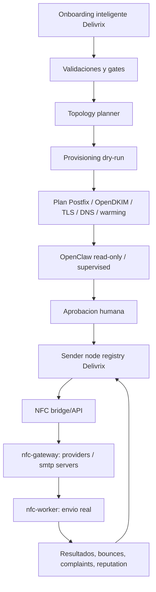

# Norte operativo Delivrix

Fecha: 2026-05-02

Este documento es la fuente de verdad para entender como debe funcionar el sistema. Si otro documento parece contradecir este norte, se debe corregir ese documento o leerlo como historico.

## Definicion corta

Delivrix es un control plane de infraestructura, reputacion, compliance, auditoria y automatizacion para mailing autorizado.

NFC es el sistema que hoy opera campanas, proveedores, colas, registros y envio.

OpenClaw es el operador asistido por IA que observa, planifica, propone y, solo por etapas, ejecuta acciones permitidas.

## Regla principal

En la fase actual, Delivrix no reemplaza el envio de NFC.

Delivrix crea y gobierna capacidad de infraestructura. NFC decide y ejecuta el envio usando su pipeline actual.

## Que debe hacer Delivrix

- Guiar el onboarding inteligente de servidor fisico, Proxmox, IPs, dominios y limites.
- Planificar clusters, VPS/LXC y sender nodes.
- Preparar la configuracion de Postfix, OpenDKIM, TLS, DNS rutinario y warming.
- Mantener inventario de sender nodes, IPs, dominios, estados, reputacion y capacidad.
- Aplicar gates de compliance, suppression, opt-out, bounces, complaints, blacklists y kill switch.
- Auditar acciones humanas y autonomas.
- Producir reportes y recomendaciones operativas.
- Exponer un bridge/API para sincronizar capacidad con NFC cuando el contrato sea seguro.

## Que debe hacer NFC

- Mantener el flujo actual de campanas.
- Administrar recipients, templates, email registries, orders, webhooks y resultados.
- Cargar providers activos.
- Ejecutar envio real desde `nfc-worker`.
- Aplicar sus limites internos de provider, cola y worker.
- Recibir, cuando este aprobado, capacidad provisionada por Delivrix como `email_providers` y `smtp_servers`.

## Que debe hacer OpenClaw

- Fase inicial: leer, analizar y reportar.
- Fase supervised: proponer acciones y esperar aprobacion humana.
- Fase limitada: ejecutar solo acciones reversibles, acotadas y auditadas.
- Fase avanzada: ampliar autonomia solo si los gates operativos demuestran estabilidad.

OpenClaw nunca debe empezar con autonomia plena.

## Como funciona el sistema

1. El operador completa onboarding con datos de servidor, IPs, dominios, DNS, limites y permisos.
2. Delivrix valida los datos contra compliance, seguridad y capacidad.
3. El topology planner genera un plan de clusters/VPS/LXC.
4. El provisioning flow produce un plan dry-run para Proxmox, Postfix, OpenDKIM, TLS, DNS y warming.
5. OpenClaw analiza el plan y genera riesgos, recomendaciones y acciones propuestas.
6. Un humano aprueba cualquier accion real.
7. Delivrix registra sender nodes y reputacion en su inventario.
8. El bridge NFC genera payloads compatibles para registrar capacidad como providers/SMTP servers.
9. NFC usa esa capacidad desde su worker cuando este habilitada.
10. Delivrix observa bounces, complaints, blacklists, colas, warming y resultados para pausar, degradar o recomendar cambios.

## Diagrama operativo

## Contratos de integracion

El bridge Delivrix -> NFC debe priorizar API. Escritura directa en base de datos solo se considera si no existe endpoint seguro y queda aprobada explicitamente.

Contratos minimos:

- Provider SMTP compatible con `email_providers`.
- SMTP server compatible con `smtp_servers`.
- Health/reputation state.
- Daily limit y rate limit.
- Estado operativo: active, warming, paused, degraded, quarantined, retired.
- Trazabilidad de origen Delivrix.
- Auditoria de cada alta, cambio o pausa.

## Gates no negociables

- No hay envio real desde Delivrix en la fase actual.
- No hay escritura en NFC produccion sin contrato aprobado.
- No hay SSH real sin aprobacion humana.
- No hay cambios DNS reales sin dry-run y aprobacion.
- No hay aumento de volumen sin warming saludable.
- No hay rotacion de IP para sostener volumen ante bounces, complaints o blacklists.
- No hay secretos en Git.
- No hay credenciales SMTP en texto plano en produccion.
- Kill switch debe bloquear nuevas acciones y procesamiento operativo.

## Hitos subordinados al norte

1. Fase 1: nucleo seguro local, policy engine, audit log y cola simulada.
2. Fase 2: Webdock bridge seguro para continuidad y visibilidad.
3. Fase 3: Proxmox/provisioning mock, reputacion, cuarentena y backups simulados.
4. Fase 4: OpenClaw read-only/supervised, onboarding, topology planner y NFC bridge mock.
5. Fase 5: demo end-to-end sin ambiguedad: Delivrix gobierna capacidad; NFC envia.
6. Fases posteriores: ejecucion real gradual, siempre por gates y evidencia.

## Criterio de claridad

Cada documento nuevo debe responder estas preguntas:

- Que componente toma la decision?
- Que componente ejecuta la accion?
- Que datos se comparten?
- Que queda en dry-run?
- Que requiere aprobacion humana?
- Como se audita?
- Como se detiene?
