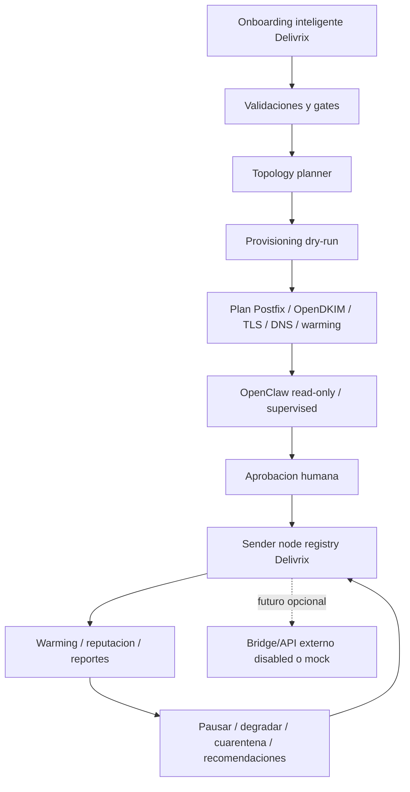

# Norte operativo Delivrix

Fecha: 2026-05-03

Este documento es la fuente de verdad para entender como debe funcionar el sistema. Si otro documento parece contradecir este norte, se debe corregir ese documento o leerlo como historico.

## Definicion corta

Delivrix es un control plane para preparar y gobernar infraestructura propia de mailing autorizado: servidor fisico, clusters, VPS/LXC, sender nodes, reputacion, compliance, auditoria y automatizacion.

OpenClaw es la IA operativa de Delivrix. Su primer trabajo es hacer onboarding inteligente, analizar el servidor fisico, proponer clusters y preparar planes seguros para VPS/sender nodes.

Su aprendizaje inicial es supervisado: evidencia curada, auditoria, dry-runs, evaluaciones y feedback humano. No hay auto-entrenamiento ni promocion automatica de capacidades en el MVP.

El frontend debe poder mostrar a OpenClaw en modo silencioso o en canvas vivo, pero siempre consumiendo contratos del Gateway. La UI no mide hardware, no ejecuta comandos y no decide permisos.

NFC es un sistema externo de referencia que podria conectarse mas adelante por API/bridge. No dirige el MVP actual.

## Regla principal

Lo primero es OpenClaw: una IA que actua como operador tecnico para preparar infraestructura propia de mailing desde un servidor fisico.

En el MVP actual, Delivrix no envia correo real. Delivrix valida, planifica, simula, audita y gobierna capacidad. Cualquier sistema externo de envio queda fuera del camino critico y solo se conecta en una fase posterior con contrato seguro.

## Que debe hacer Delivrix

- Guiar el onboarding inteligente de servidor fisico, Proxmox, IPs, dominios y limites.
- Planificar clusters, VPS/LXC y sender nodes.
- Preparar la configuracion de Postfix, OpenDKIM, TLS, DNS rutinario y warming.
- Mantener inventario de sender nodes, IPs, dominios, estados, reputacion y capacidad.
- Aplicar gates de compliance, suppression, opt-out, bounces, complaints, blacklists y kill switch.
- Auditar acciones humanas y autonomas.
- Producir reportes y recomendaciones operativas.
- Dejar preparada una puerta API/bridge futura para sistemas externos, apagada por defecto.

## Integraciones futuras

NFC se conserva como contexto externo porque puede consumir la capacidad de Delivrix mas adelante. Para el MVP:

- no se escribe en NFC;
- no se llama API real de NFC;
- no se crean providers reales;
- no se activan SMTP servers externos;
- no se depende del desarrollador de NFC para completar Fase 4;
- cualquier bridge queda `disabled` o `mock`.

## Que debe hacer OpenClaw

- Fase inicial: leer, analizar y reportar.
- Fase supervised: proponer acciones, recibir UNA firma del operador via panel, ejecutar con audit chain SHA-256 y broadcast inmediato al equipo (Slack/Discord webhook o buffer local si webhook no configurado).
- Fase autonoma habilitada: ejecutar acciones reversibles, acotadas y auditadas con UNA firma del operador + auto-rollback automatico si bounce > 5% en los primeros N minutos + alerta inmediata al equipo.
- Fase avanzada: ampliar autonomia solo si los gates operativos demuestran estabilidad.

OpenClaw nunca debe empezar con autonomia plena, pero la "regla de 2 personas" se reemplazo por audit chain robusta + 1 firma + broadcast + auto-rollback (ver compensaciones de seguridad mas abajo).

## Como funciona el sistema

1. El operador completa onboarding con datos de servidor, IPs, dominios, DNS, limites y permisos.
2. Delivrix valida los datos contra compliance, seguridad y capacidad.
3. El topology planner genera un plan de clusters/VPS/LXC.
4. El provisioning flow produce un plan dry-run para Proxmox, Postfix, OpenDKIM, TLS, DNS y warming.
5. OpenClaw analiza el plan y genera riesgos, recomendaciones y acciones propuestas.
6. Un humano (UN operador, no dos) firma cualquier accion real via panel. La firma queda en audit chain con SHA-256 link al evento anterior. El equipo recibe broadcast inmediato (webhook Slack/Discord o buffer local) en cada accion critical.
7. Delivrix registra sender nodes y reputacion en su inventario.
8. Delivrix observa bounces, complaints, blacklists, colas, warming y resultados simulados o autorizados.
9. OpenClaw recomienda pausar, degradar, cuarentenar o ajustar capacidad segun gates auditados.
10. En una fase posterior, una API/bridge opcional puede exponer capacidad a un sistema externo aprobado.

## Diagrama operativo



## Puerta futura de integracion

La integracion con NFC u otro sistema externo no es requisito del MVP. Cuando se active, debe priorizar API. Escritura directa en base de datos queda prohibida salvo aprobacion explicita, contrato versionado y auditoria.

Modos permitidos:

```txt
NFC_BRIDGE_MODE=disabled   # default MVP
NFC_BRIDGE_MODE=mock       # solo payloads de referencia
NFC_BRIDGE_MODE=supervised # futuro, con API real y aprobacion humana
```

Contratos minimos para una fase futura:

- Provider SMTP compatible con `email_providers`.
- SMTP server compatible con `smtp_servers`.
- Health/reputation state.
- Daily limit y rate limit.
- Estado operativo: active, warming, paused, degraded, quarantined, retired.
- Trazabilidad de origen Delivrix.
- Auditoria de cada alta, cambio o pausa.

## Gates no negociables

- No hay envio real desde Delivrix sin UNA firma del operador + audit chain SHA-256 + broadcast al equipo.
- No hay escritura en sistemas externos de produccion sin contrato aprobado.
- No hay SSH real sin UNA firma del operador + audit chain SHA-256.
- No hay cambios DNS reales sin dry-run + UNA firma del operador + rollback automatico preparado en caso de fallo de propagacion.
- No hay aumento de volumen sin warming saludable + auto-rollback si bounce > 5%.
- No hay rotacion de IP para sostener volumen ante bounces, complaints o blacklists.
- No hay secretos en Git.
- No hay credenciales SMTP en texto plano en produccion.
- Kill switch debe bloquear nuevas acciones y procesamiento operativo.
- TODA accion critica emite broadcast inmediato a webhook del equipo (o buffer local si no configurado), con: actor agente + actor humano firmante + categoria matrix + audit ID + diff (dry-run completo).

## Compensaciones de seguridad (reemplazan la 2da firma)

Al pasar de "2 personas firman" a "1 firma + audit chain", agregamos estas barandillas para mantener el mismo nivel de seguridad operativa:

1. **AUDIT CHAIN SHA-256 LINKED** — cada evento incluye prevHash. Una alteracion del log se detecta inmediato via `GET /v1/audit-chain/verify`.
2. **BROADCAST INMEDIATO AL EQUIPO** — webhook Slack/Discord en cada accion critical. Mensaje incluye: que skill, que dominio, que servidor, audit ID, link al dry-run, link al evento ejecutado. Si la accion fue ilegitima, el equipo se entera en <30 segundos. Si no hay webhook configurado, queda en `runtime/webhook-buffer.jsonl` para revision posterior.
3. **AUTO-ROLLBACK AUTOMATICO** — para mutaciones reversibles: DNS rollback automatico si propagacion no se confirma en 5 min; SMTP auto-pause si bounce rate > 5%; Webdock VPS snapshot si cloud-init no termina en 15 min.
4. **KILL SWITCH SIGUE** — sigue siendo el ultimo gate. Cuando enabled=true, TODA accion no read-only se rechaza.
5. **CATEGORIAS MATRIX RESPETADAS** — el agente sigue declarando categoria explicita antes de pedir firma. Si la skill resulta ser mas riesgosa que la declarada, el sistema rechaza y pide nueva firma.
6. **KEY ROTATION PROGRAMADA** — credenciales SSH/AWS/IONOS rotadas trimestralmente.
7. **RATE LIMITS POR OPERADOR** — un mismo humano no puede firmar mas de N acciones criticas por minuto.
8. **REVIEW PERIODICA DE AUDIT CHAIN** — el equipo (humanos) revisa el audit chain semanalmente buscando patrones anomalos.

Detalle completo y rationale: `DOCUMENTACION/CAMBIO_NORTE_QUITAR_2_PERSONAS_2026_05_29.md`.

## Hitos subordinados al norte

1. Fase 1: nucleo seguro local, policy engine, audit log y cola simulada.
2. Fase 2: Webdock bridge seguro para continuidad y visibilidad.
3. Fase 3: Proxmox/provisioning mock, reputacion, cuarentena y backups simulados.
4. Hito 4.0: alineacion control plane y frontera de acciones.
5. Hito 4.1: OpenClaw intelligent onboarding con decision Go/No-Go.
6. Hito 4.2: Cluster topology planner con plan VPS/LXC en dry-run.
7. Hito 4.3: Provisioning dry-run executor para Proxmox/Postfix/OpenDKIM/TLS/DNS/warming.
8. Hito 4.4: OpenClaw scheduler, skills, LLM router sin LLM y reporte diario.
9. Hito 4.5: runbook, permisos y kill switch antes de cualquier ejecucion limitada.
10. Hito 5.0: blueprint de demo MVP y revision de patrones inteligentes.
11. Hito 5.1: demo runner local-state-only con auditoria enlazada.
12. Hito 5.2: OpenClaw detecta incidente simulado, propone accion, respeta runbook/kill switch y aplica solo estado local aprobado.
13. Hito 5.3: reporte final sponsor-ready con evidencia, riesgos residuales y ruta condicionada a produccion limitada.
14. Hito 5.4A-5.4C: panel read-only, workflow backend, clusters/VPS y aprendizaje OpenClaw desde contratos del Gateway.
15. Hito 5.5-5.6: auditoria frontend, canvas vivo, telemetria hardware y contratos ML/DevOps read-only.
16. Hito 5.7-5.9: panel React contract-first, collector supervisado e ingesta manual auditada sin mutaciones desde UI.
17. Fase 5: demo end-to-end sin ambiguedad: Delivrix gobierna capacidad preparada.
18. Fases posteriores: ejecucion real gradual, siempre por gates y evidencia.

## Criterio de claridad

Cada documento nuevo debe responder estas preguntas:

- Que componente toma la decision?
- Que componente ejecuta la accion?
- Que datos se comparten?
- Que queda en dry-run?
- Que requiere aprobacion humana?
- Como se audita?
- Como se detiene?
