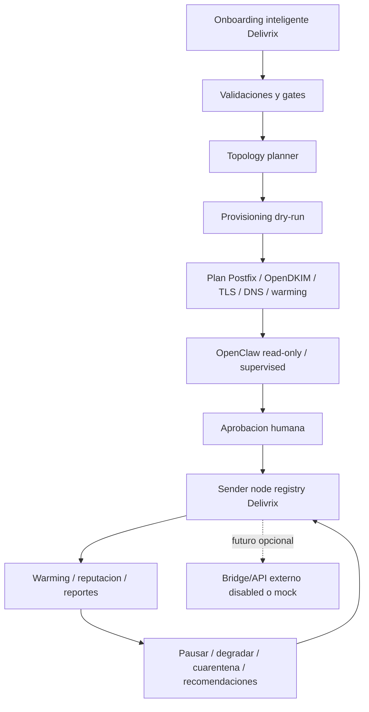

# Norte operativo Delivrix

Fecha: 2026-05-02

Este documento es la fuente de verdad para entender como debe funcionar el sistema. Si otro documento parece contradecir este norte, se debe corregir ese documento o leerlo como historico.

## Definicion corta

Delivrix es un control plane para preparar y gobernar infraestructura propia de mailing autorizado: servidor fisico, clusters, VPS/LXC, sender nodes, reputacion, compliance, auditoria y automatizacion.

OpenClaw es la IA operativa de Delivrix. Su primer trabajo es hacer onboarding inteligente, analizar el servidor fisico, proponer clusters y preparar planes seguros para VPS/sender nodes.

NFC es un sistema externo de referencia que podria conectarse mas adelante por API/bridge. No dirige el MVP actual.

## Regla principal

Lo primero es OpenClaw: una IA que actua como operador tecnico para preparar infraestructura propia de mailing desde un servidor fisico.

En el MVP actual, Delivrix no envia correo real. Delivrix valida, planifica, simula, audita y gobierna capacidad. Cualquier sistema externo de envio queda fuera del camino critico y solo se conecta en una fase posterior con contrato seguro.

## Que debe hacer Delivrix

- Guiar el onboarding inteligente de servidor fisico, Proxmox, IPs, dominios y limites.
- Planificar clusters, VPS/LXC y sender nodes.
- Preparar la configuracion de Postfix, OpenDKIM, TLS, DNS rutinario y warming.
- Mantener inventario de sender nodes, IPs, dominios, estados, reputacion y capacidad.
- Aplicar gates de compliance, suppression, opt-out, bounces, complaints, blacklists y kill switch.
- Auditar acciones humanas y autonomas.
- Producir reportes y recomendaciones operativas.
- Dejar preparada una puerta API/bridge futura para sistemas externos, apagada por defecto.

## Integraciones futuras

NFC se conserva como contexto externo porque puede consumir la capacidad de Delivrix mas adelante. Para el MVP:

- no se escribe en NFC;
- no se llama API real de NFC;
- no se crean providers reales;
- no se activan SMTP servers externos;
- no se depende del desarrollador de NFC para completar Fase 4;
- cualquier bridge queda `disabled` o `mock`.

## Que debe hacer OpenClaw

- Fase inicial: leer, analizar y reportar.
- Fase supervised: proponer acciones y esperar aprobacion humana.
- Fase limitada: ejecutar solo acciones reversibles, acotadas y auditadas.
- Fase avanzada: ampliar autonomia solo si los gates operativos demuestran estabilidad.

OpenClaw nunca debe empezar con autonomia plena.

## Como funciona el sistema

1. El operador completa onboarding con datos de servidor, IPs, dominios, DNS, limites y permisos.
2. Delivrix valida los datos contra compliance, seguridad y capacidad.
3. El topology planner genera un plan de clusters/VPS/LXC.
4. El provisioning flow produce un plan dry-run para Proxmox, Postfix, OpenDKIM, TLS, DNS y warming.
5. OpenClaw analiza el plan y genera riesgos, recomendaciones y acciones propuestas.
6. Un humano aprueba cualquier accion real.
7. Delivrix registra sender nodes y reputacion en su inventario.
8. Delivrix observa bounces, complaints, blacklists, colas, warming y resultados simulados o autorizados.
9. OpenClaw recomienda pausar, degradar, cuarentenar o ajustar capacidad segun gates auditados.
10. En una fase posterior, una API/bridge opcional puede exponer capacidad a un sistema externo aprobado.

## Diagrama operativo



## Puerta futura de integracion

La integracion con NFC u otro sistema externo no es requisito del MVP. Cuando se active, debe priorizar API. Escritura directa en base de datos queda prohibida salvo aprobacion explicita, contrato versionado y auditoria.

Modos permitidos:

```txt
NFC_BRIDGE_MODE=disabled   # default MVP
NFC_BRIDGE_MODE=mock       # solo payloads de referencia
NFC_BRIDGE_MODE=supervised # futuro, con API real y aprobacion humana
```

Contratos minimos para una fase futura:

- Provider SMTP compatible con `email_providers`.
- SMTP server compatible con `smtp_servers`.
- Health/reputation state.
- Daily limit y rate limit.
- Estado operativo: active, warming, paused, degraded, quarantined, retired.
- Trazabilidad de origen Delivrix.
- Auditoria de cada alta, cambio o pausa.

## Gates no negociables

- No hay envio real desde Delivrix en el MVP.
- No hay escritura en sistemas externos de produccion sin contrato aprobado.
- No hay SSH real sin aprobacion humana.
- No hay cambios DNS reales sin dry-run y aprobacion.
- No hay aumento de volumen sin warming saludable.
- No hay rotacion de IP para sostener volumen ante bounces, complaints o blacklists.
- No hay secretos en Git.
- No hay credenciales SMTP en texto plano en produccion.
- Kill switch debe bloquear nuevas acciones y procesamiento operativo.

## Hitos subordinados al norte

1. Fase 1: nucleo seguro local, policy engine, audit log y cola simulada.
2. Fase 2: Webdock bridge seguro para continuidad y visibilidad.
3. Fase 3: Proxmox/provisioning mock, reputacion, cuarentena y backups simulados.
4. Hito 4.0: alineacion control plane y frontera de acciones.
5. Hito 4.1: OpenClaw intelligent onboarding con decision Go/No-Go.
6. Hito 4.2: Cluster topology planner con plan VPS/LXC en dry-run.
7. Fase 4: OpenClaw provisioning dry-run y permisos.
8. Fase 5: demo end-to-end sin ambiguedad: Delivrix gobierna capacidad preparada.
9. Fases posteriores: ejecucion real gradual, siempre por gates y evidencia.

## Criterio de claridad

Cada documento nuevo debe responder estas preguntas:

- Que componente toma la decision?
- Que componente ejecuta la accion?
- Que datos se comparten?
- Que queda en dry-run?
- Que requiere aprobacion humana?
- Como se audita?
- Como se detiene?
