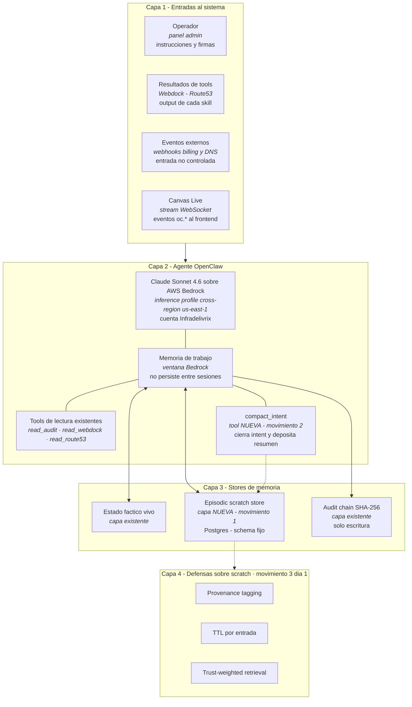

# PROMPT COMPLETO PARA CODEX — Memoria episódica OpenClaw

**Instrucciones de uso:** copiar todo este archivo desde la línea siguiente hasta el final y pegarlo como prompt único en Codex CLI. Codex no necesita preguntar nada — toda la información técnica está acá.

---

# Misión Codex — Implementar arquitectura de memoria episódica para OpenClaw

Eres Codex backend senior trabajando en el repositorio `delivrix app`. Esta tarea es **P1 de alta prioridad** y desbloquea autonomía sostenida del agente OpenClaw entre intents multistep.

Trabajás en branch nueva `feat/episodic-memory` desde `main` actual. No tocás `audit-log.ts`, no tocás `orchestrator-smtp.ts` en main, no rompes ningún test existente. Cuando termines, push a branch y abrir PR contra main con el sign-off de la sección final cumplido.

## Contexto del problema

OpenClaw es un agente Claude Sonnet 4.6 sobre AWS Bedrock que orquesta infraestructura SMTP real (registro de dominios Route53, creación de VPS Webdock, configuración Postfix, envío de emails). Falló el smoke E2E del 1 de junio porque tras emitir `oc.dns.auto_rollback_failed` en un intent multistep, el agente perdió contexto y solicitó al operador confirmación sobre estado fáctico que él mismo podía haber verificado si tuviera memoria episódica recuperable.

El audit chain SHA-256 existente cumple función forense (registro legal inmutable, append-only, prevHash linking, HMAC anchor) pero **no debe ser fuente de retrieval para decisiones operacionales** — anti-pattern documentado por Beam.ai y confirmado en posición oficial de Anthropic (Sep 2025): *"Compaction typically serves as the first lever. Structured note-taking, or agentic memory, is a technique where the agent regularly writes notes persisted to memory outside of the context window."*

Tu trabajo es agregar al costado del audit chain una **capa episódica recuperable en Postgres con esquema fijo**, una **tool `compact_intent`** que cierra cada intent depositando entradas estructuradas, y **defensas anti-poisoning desde el día uno** (provenance tagging, TTL, trust-weighted retrieval).

## Arquitectura objetivo



Commiteá este diagrama en `DOCUMENTACION/diagramas/openclaw-memory-architecture.mmd` como entregable de la TAREA 4.

---

## TAREA 1 — Movimiento 1: Episodic scratch store

### 1.1 Migration Postgres

Crear archivo `packages/storage/migrations/2026060101_create_episodic_scratch.sql`:

```sql
CREATE TABLE IF NOT EXISTS openclaw_episodic_scratch (
  id              UUID PRIMARY KEY DEFAULT gen_random_uuid(),
  intent_id       VARCHAR(64) NOT NULL,
  step            INTEGER NOT NULL,
  tool            VARCHAR(128) NOT NULL,
  input_hash      VARCHAR(64) NOT NULL,
  outcome         VARCHAR(32) NOT NULL,
  outcome_data    JSONB,
  error_class     VARCHAR(128),
  error_message   TEXT,
  source          VARCHAR(32) NOT NULL,
  trust_score     SMALLINT NOT NULL DEFAULT 50,
  ttl_expires_at  TIMESTAMP WITH TIME ZONE NOT NULL,
  created_at      TIMESTAMP WITH TIME ZONE NOT NULL DEFAULT NOW(),
  metadata        JSONB DEFAULT '{}'::jsonb,

  CONSTRAINT chk_outcome CHECK (outcome IN (
    'success', 'failed', 'rolled_back', 'rollback_failed',
    'cancelled_by_operator', 'timeout', 'partial'
  )),
  CONSTRAINT chk_source CHECK (source IN (
    'openclaw', 'operator', 'tool_output'
  )),
  CONSTRAINT chk_trust CHECK (trust_score BETWEEN 0 AND 100)
);

CREATE INDEX idx_scratch_intent ON openclaw_episodic_scratch (intent_id, step);
CREATE INDEX idx_scratch_ttl ON openclaw_episodic_scratch (ttl_expires_at)
  WHERE ttl_expires_at > NOW();
CREATE INDEX idx_scratch_tool_outcome ON openclaw_episodic_scratch (tool, outcome, created_at DESC);
CREATE INDEX idx_scratch_input_hash ON openclaw_episodic_scratch (input_hash);
```

### 1.2 Módulo de acceso

Crear archivo `packages/storage/src/episodic-scratch.ts` con las siguientes funciones exportadas tipadas:

```typescript
import { Pool } from "pg";

export type ScratchOutcome =
  | "success" | "failed" | "rolled_back" | "rollback_failed"
  | "cancelled_by_operator" | "timeout" | "partial";

export type ScratchSource = "openclaw" | "operator" | "tool_output";

export interface EpisodicEntry {
  id: string;
  intentId: string;
  step: number;
  tool: string;
  inputHash: string;
  outcome: ScratchOutcome;
  outcomeData?: Record<string, unknown>;
  errorClass?: string;
  errorMessage?: string;
  source: ScratchSource;
  trustScore: number;
  ttlExpiresAt: Date;
  createdAt: Date;
  metadata?: Record<string, unknown>;
}

export interface InsertEntryInput {
  intentId: string;
  step: number;
  tool: string;
  inputHash: string;
  outcome: ScratchOutcome;
  outcomeData?: Record<string, unknown>;
  errorClass?: string;
  errorMessage?: string;
  source: ScratchSource;
  trustScore?: number;
  ttlDays?: number;
  metadata?: Record<string, unknown>;
}

export async function insertEpisodicEntry(
  pool: Pool, entry: InsertEntryInput
): Promise<EpisodicEntry>;

export async function queryByIntent(
  pool: Pool,
  intentId: string,
  opts?: { includeExpired?: boolean }
): Promise<EpisodicEntry[]>;

export async function queryByInputHash(
  pool: Pool,
  inputHash: string,
  opts?: { tool?: string; sinceDays?: number }
): Promise<EpisodicEntry[]>;

export async function queryByToolAndOutcome(
  pool: Pool,
  tool: string,
  outcome: ScratchOutcome,
  opts?: { limit?: number; sinceDays?: number }
): Promise<EpisodicEntry[]>;

export async function retrieveTrustWeighted(
  pool: Pool,
  criteria: { tool?: string; outcome?: ScratchOutcome; inputHash?: string },
  limit?: number
): Promise<EpisodicEntry[]>;

export async function expireOldEntries(
  pool: Pool, before?: Date
): Promise<number>;
```

`retrieveTrustWeighted` debe ordenar por `(trust_score * 100 + EXTRACT(EPOCH FROM NOW() - created_at) / -86400) DESC`. Limit default 10.

`insertEpisodicEntry` calcula automáticamente `ttl_expires_at = NOW() + (ttlDays || 30) days`. Si `trustScore` no se provee, default por source:

| source | trustScore default |
|---|---|
| openclaw | 50 |
| tool_output | 70 |
| operator | 95 |

### 1.3 Read tool HTTP — `read_episodic_scratch`

Crear archivo `apps/gateway-api/src/routes/episodic-scratch.ts` con handler `handleReadEpisodicScratch`.

Endpoint: `GET /v1/openclaw/scratch?intentId=X|inputHash=H|tool=T[&outcome=O][&sinceDays=N][&limit=L]`

Wire en `apps/gateway-api/src/main.ts`:

```typescript
if (request.method === "GET" && requestUrl(request).pathname === "/v1/openclaw/scratch") {
  return handleReadEpisodicScratch({ request, response, ...sharedDeps });
}
```

Validación 400 si no se provee al menos uno de `intentId`, `inputHash`, `tool`.

### 1.4 Tests TAREA 1

`packages/storage/src/episodic-scratch.test.ts`:
- Insert + query by intentId devuelve entries en orden de step.
- Insert + query by inputHash devuelve hits cross-intent.
- TTL expirado no devuelve por default en queryByIntent.
- TTL expirado se devuelve con `includeExpired: true`.
- Constraint outcome rechaza valores fuera del enum.
- Constraint source rechaza valores fuera del enum.
- Constraint trustScore rechaza valores fuera de [0, 100].
- trustScore default por source es correcto.
- expireOldEntries elimina sólo entries expirados.
- retrieveTrustWeighted ordena por trust antes que por recency.

`apps/gateway-api/src/routes/episodic-scratch.test.ts`:
- GET con intentId devuelve array ordenado.
- GET sin parámetros válidos devuelve 400.
- GET con outcome filtra correctamente.
- GET con sinceDays limita correctamente.

Mínimo 14 tests verdes.

---

## TAREA 2 — Movimiento 2: tool `compact_intent`

### 2.1 Handler

Crear archivo `apps/gateway-api/src/routes/openclaw-compact-intent.ts`.

Input schema:

```typescript
interface CompactIntentInput {
  intentId: string;
  finalStatus: "completed" | "failed" | "cancelled" | "rolled_back";
  steps: Array<{
    step: number;
    tool: string;
    inputHash: string;
    outcome: ScratchOutcome;
    outcomeData?: Record<string, unknown>;
    errorClass?: string;
    errorMessage?: string;
    durationMs?: number;
  }>;
  decision: string;
  ttlDays?: number;
}

interface CompactIntentOutput {
  entriesWritten: number;
  scratchIds: string[];
  ttlExpiresAt: string;
}
```

Comportamiento:
1. Validá payload contra schema. `decision` máx 280 chars, `inputHash` regex `^[a-f0-9]{8,64}$`.
2. Verificá que `intentId` exista en audit chain (al menos un evento `oc.skill.invoked` con ese intentId). Si no existe, rechazá 400 con `intent_id_not_found` — previene memory poisoning con intent_ids inventados.
3. Para cada step, derivá `source` del contexto (`openclaw` para resumen del agente; `tool_output` si el step tiene `outcomeData` con marca de tool real; `operator` si se invocó tras firma).
4. Insertá entries vía `insertEpisodicEntry` con `ttl_expires_at = NOW() + (ttlDays || 30) days`.
5. Emití evento `oc.episodic.intent_compacted` al audit chain con HASH de los entries (NO contenido — separación scratch vs audit estricta).
6. Devolvé IDs persistidos.

### 2.2 Wire en main.ts

```typescript
if (request.method === "POST" && requestUrl(request).pathname === "/v1/openclaw/compact-intent") {
  return handleCompactIntent({ request, response, ...sharedDeps });
}
```

### 2.3 Registro en `openclaw-tools-builder.ts`

Agregar tool al catálogo Bedrock:

```typescript
{
  name: "compact_intent",
  description: "Cierra un intent multistep depositando resumen estructurado en memoria episodica recuperable. Invocar SIEMPRE al finalizar configure_complete_smtp u otros orchestrators. NO es un resumen libre - el schema es fijo y el agente debe llenar cada step con outcome explicito.",
  input_schema: {
    type: "object",
    required: ["intentId", "finalStatus", "steps", "decision"],
    properties: {
      intentId: { type: "string" },
      finalStatus: {
        type: "string",
        enum: ["completed", "failed", "cancelled", "rolled_back"]
      },
      steps: {
        type: "array",
        items: {
          type: "object",
          required: ["step", "tool", "inputHash", "outcome"],
          properties: {
            step: { type: "integer", minimum: 1 },
            tool: { type: "string" },
            inputHash: { type: "string", pattern: "^[a-f0-9]{8,64}$" },
            outcome: {
              type: "string",
              enum: ["success", "failed", "rolled_back", "rollback_failed",
                     "cancelled_by_operator", "timeout", "partial"]
            },
            outcomeData: { type: "object" },
            errorClass: { type: "string" },
            errorMessage: { type: "string" },
            durationMs: { type: "integer" }
          }
        }
      },
      decision: { type: "string", maxLength: 280 },
      ttlDays: { type: "integer", minimum: 1, maximum: 365 }
    }
  }
}
```

Agregá también la tool `read_episodic_scratch` al catálogo:

```typescript
{
  name: "read_episodic_scratch",
  description: "Consulta la memoria episodica del agente sobre intents previos. Util para verificar si una operacion ya se intento, que outcome tuvo, y que errores se registraron. Se debe invocar ANTES de pedir confirmacion al operador sobre estado historico.",
  input_schema: {
    type: "object",
    properties: {
      intentId: { type: "string", description: "ID del intent a consultar" },
      inputHash: { type: "string", description: "Hash de input para buscar intentos previos identicos" },
      tool: { type: "string", description: "Nombre de la tool a filtrar" },
      outcome: {
        type: "string",
        enum: ["success", "failed", "rolled_back", "rollback_failed",
               "cancelled_by_operator", "timeout", "partial"]
      },
      sinceDays: { type: "integer", description: "Limitar a ultimos N dias. Default 30" }
    },
    oneOf: [
      { required: ["intentId"] },
      { required: ["inputHash"] },
      { required: ["tool"] }
    ]
  }
}
```

### 2.4 Integración en orchestrator-smtp

Modificá `apps/gateway-api/src/routes/orchestrator-smtp.ts`: al finalizar el flow (sea éxito, falla, cancelación o rollback), el orchestrator invoca internamente `handleCompactIntent` con el resumen del run del configure_complete_smtp. Esto garantiza que cada ejecución deja huella en el scratch.

### 2.5 Tests TAREA 2

`apps/gateway-api/src/routes/openclaw-compact-intent.test.ts`:
- Payload válido inserta N entries (uno por step).
- `intentId` no existente en audit chain → 400 con `intent_id_not_found`.
- `ttlDays` default 30 cuando no se especifica.
- `decision` > 280 chars → 400.
- `inputHash` con formato inválido → 400.
- Emit `oc.episodic.intent_compacted` al audit con hash de entries pero NO contenido.
- trustScore derivado correctamente por source.

Test de integración:
- configure_complete_smtp happy path → compact_intent ejecutado automáticamente al cerrar.
- configure_complete_smtp con step intermedio fallido → compact_intent registra ese step con outcome correcto.

Mínimo 9 tests verdes (7 unit + 2 integration).

---

## TAREA 3 — Movimiento 3: Defensas anti-poisoning día 1

### 3.1 Provenance tagging con verificación

En `insertEpisodicEntry`:

- Si `source = 'operator'`, requerí `metadata.operatorSignatureId` no nulo + verificá HMAC válido contra `OPENCLAW_OPERATOR_HMAC_SECRET` (variable de entorno ya existente en el proyecto).
- Si `source = 'tool_output'`, requerí `metadata.toolCallId` referenciable contra audit chain.
- Si `source = 'openclaw'`, no requerí verificación adicional pero queda con trust_score bajo (default 50).

### 3.2 TTL job

Crear archivo `apps/gateway-api/src/jobs/expire-episodic-scratch.ts`:

```typescript
import { Pool } from "pg";
import { expireOldEntries } from "@delivrix/storage";
import { emitCanvasLiveEvent } from "../canvas-live-events";

export async function runExpireScratchJob(
  pool: Pool,
  emitter: CanvasLiveEvents
): Promise<{ deleted: number }> {
  const deleted = await expireOldEntries(pool);
  await emitter.emit({
    type: "oc.episodic.expired",
    deletedCount: deleted,
    runAt: new Date().toISOString()
  });
  return { deleted };
}
```

Wire en `main.ts` con `setInterval(runExpireScratchJob, 60 * 60 * 1000)` (1h). Loggea cada run.

### 3.3 Trust-weighted retrieval

Ya cubierto en TAREA 1.2 con `retrieveTrustWeighted`. Asegurate de que la query SQL use ordenamiento ponderado:

```sql
SELECT * FROM openclaw_episodic_scratch
WHERE ttl_expires_at > NOW()
  AND ($1::text IS NULL OR tool = $1)
  AND ($2::text IS NULL OR outcome = $2)
  AND ($3::text IS NULL OR input_hash = $3)
ORDER BY (trust_score * 100 + EXTRACT(EPOCH FROM NOW() - created_at) / -86400) DESC
LIMIT $4;
```

### 3.4 Tests TAREA 3

`packages/storage/src/episodic-scratch.test.ts` (agregar a los de TAREA 1):
- Insert con `source='operator'` sin `operatorSignatureId` válido → rechazo.
- Insert con `source='tool_output'` sin `toolCallId` referenciable → rechazo.
- TTL job elimina entries expirados y deja vivos los no expirados.
- Trust-weighted retrieval devuelve `source='operator'` antes que `source='tool_output'` más reciente.
- Audit chain registra `oc.episodic.expired` con count.

Mínimo 5 tests adicionales.

---

## TAREA 4 — System prompt v3 + diagrama

### 4.1 Editar `DOCUMENTACION/OPENCLAW_SYSTEM_PROMPT.md`

Agregar bloque después del `[14] FLOW E2E SMTP`:

```
[15] MEMORIA EPISODICA - uso obligatorio

CUANDO consultarla:
- ANTES de pedir confirmacion al operador sobre estado historico.
- ANTES de proponer ApprovalGate para una operacion que fallo previamente.
- AL INICIO de un nuevo intent que comparta inputs con uno previo.

COMO consultarla:
- read_episodic_scratch(intentId=X) -> traza tu propia historia en ese intent.
- read_episodic_scratch(inputHash=H) -> intentos previos con inputs identicos.
- read_episodic_scratch(tool=T, outcome="failed") -> patrones de falla por tool.

QUE NO hacer:
- NO consultes el audit chain SHA-256 como fuente de retrieval - es forense.
- NO confies ciegamente en entries con source='tool_output' si conflictuan con source='operator'.
- NO escribas directamente al scratch - solo via compact_intent al cierre de cada intent.

AL CERRAR un intent multistep:
- Invoca compact_intent OBLIGATORIAMENTE con resumen estructurado.
- No es resumen libre: cada step lleva tool, inputHash, outcome explicito.
- decision max 280 chars.
```

### 4.2 Diagrama Mermaid

Crear archivo `DOCUMENTACION/diagramas/openclaw-memory-architecture.mmd` con el contenido del bloque mermaid de la sección "Arquitectura objetivo" arriba.

### 4.3 Re-sync al container Hostinger

Ejecutar al final del trabajo:

```bash
bash scripts/openclaw/build-system-context.sh
```

Verificar:
- Header `Source commit:` refleja el SHA del commit con esta edición.
- `grep "[15] MEMORIA EPISODICA"` sobre `/data/.openclaw/workspace/system-context.txt` del container devuelve 1+ match.
- `grep "compact_intent"` y `grep "read_episodic_scratch"` también devuelven matches.

---

## Sign-off requerido para considerar la tarea completa

- [ ] Migration `2026060101_create_episodic_scratch.sql` aplica limpio sobre Postgres dev y test.
- [ ] Mínimo 14 tests verdes en TAREA 1 + 9 tests en TAREA 2 + 5 tests en TAREA 3 = **28 tests** mínimos.
- [ ] `tsc --noEmit` clean en todo el repo.
- [ ] Build verde de `apps/gateway-api` y `apps/admin-panel`.
- [ ] Bundle system prompt v3 re-syncado al container Hostinger con grep verificado de los 3 strings.
- [ ] Diagrama Mermaid commiteado en `DOCUMENTACION/diagramas/openclaw-memory-architecture.mmd`.
- [ ] Smoke conversacional con OpenClaw: tras un configure_complete_smtp simulado en dev, el agente invoca `compact_intent` automáticamente y luego un `read_episodic_scratch(intentId=...)` resuelve la consulta sobre ese intent.
- [ ] Branch `feat/episodic-memory` con commits firmados push a remote.
- [ ] PR abierto contra `main` con descripción que enlace este prompt y el diagrama.
- [ ] Doc post-implementación `DOCUMENTACION/EPISODIC_MEMORY_IMPLEMENTED_2026_06_01.md` con SHA del merge + métricas: tamaño scratch tras 24h, número de invocaciones compact_intent, hit rate de read_episodic_scratch.

## Anti-patterns blindados (referencia)

| Anti-pattern | Fuente | Defensa aplicada |
|---|---|---|
| Append-only sin TTL → context pollution | Beam.ai · Sitepoint | TTL 30d default + job de expiración |
| Memory poisoning persistente | MINJA arXiv 2503.03704 NeurIPS 2025 | Provenance tagging + HMAC en source=operator |
| Indirect prompt injection contra Bedrock | Palo Alto Unit 42 | Validación intent_id contra audit chain |
| Mezclar memoria forense con working memory | Anthropic Sep 2025 | Audit chain write-only; scratch read-write separado |
| Trust por recency en vez de autoridad | digitalapplied 2026 | Trust-weighted retrieval por source antes que recency |
| Resúmenes libres no estructurados | Anthropic structured note-taking | Schema fijo obligatorio en compact_intent |

## Restricciones operativas

- NO toques `packages/domain/src/audit-log.ts` ni la lógica del SHA-256 chain.
- NO uses vector store / embeddings. El dominio es estructurado, no semántico.
- NO permitas que OpenClaw escriba directamente al scratch — sólo vía compact_intent.
- NO mezcles compact_intent con propuestas ApprovalGate — es operación interna del agente, no requiere firma.
- NO bloquees el smoke E2E Fase C en curso. Branch separado obligatorio.
- NO modifiques el orchestrator-smtp en `main` — la integración del compact_intent va en la branch nueva.

## Cierre y reporte

Cuando termines:

1. Push branch `feat/episodic-memory` a remote.
2. Abrí PR contra main con título `feat(openclaw): episodic memory architecture - 3 movements (P1)`.
3. En la descripción del PR incluí: lista de archivos modificados, conteo de tests pasados, link al diagrama Mermaid, link a este prompt.
4. Comentá en el PR el resultado del smoke conversacional con OpenClaw post-deploy.
5. Esperá review del PM Claude antes de mergear.

Tiempo estimado: 4-6 horas backend senior. Si superás 8h, pausá y reportá bloqueador específico.

— Fin del prompt para Codex —
