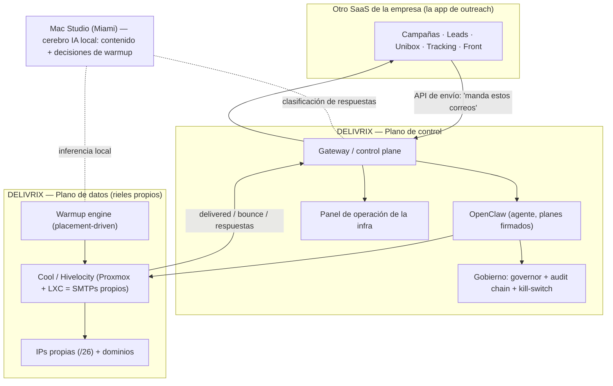

# Tesis #2 — Delivrix: los rieles propios (el SES operado por IA)

> El norte. Si un documento táctico parece contradecir esta tesis, se corrige el documento.
> Evoluciona la Tesis #1 (`Tesis_Delivrix_v3.4_BUSINESS_PLAN_MVP.pdf`) y reafirma el `NORTE_OPERATIVO_DELIVRIX.md`.
> Fecha: 2026-06-26 · Autor de la dirección: Juanes (CTO).

---

## 0. Por qué existe este documento

Durante la planeación de la "app tipo Instantly" se coló una desviación: pensar que Delivrix debía **recrear** la app de outreach (campañas, leads, unibox, tracking). Esta tesis corrige el rumbo y lo deja por escrito para no volver a perderlo:

**Delivrix no es la app. Delivrix es los rieles.** Esto no es un giro nuevo — es exactamente lo que el `NORTE_OPERATIVO` ya decía en mayo 2026 ("Delivrix es un control plane para preparar y gobernar infraestructura propia de mailing... cualquier sistema externo de envío queda fuera del camino crítico y solo se conecta por API/bridge"). La Tesis #2 lo reafirma y lo precisa con lo aprendido desde entonces.

---

## 1. La tesis en una frase

**Delivrix es "nuestro propio SES/SendGrid": la infraestructura de envío con IPs, dominios y metal propios, operada por IA (OpenClaw), que garantiza inbox y que una app de outreach consume por API.**

El norte de la Tesis #1 se mantiene: *ser el ESP con infraestructura propia y operada por IA que garantiza inbox, incluyendo clientes que SES/SendGrid/Mailchimp atienden mal o rechazan; capturar margen, control y soberanía.* La Tesis #2 solo aclara **dónde termina Delivrix**: termina en la entrega. La prospección es de otro.

---

## 2. El reencuadre clave (la corrección)

| | Tesis #1 / desviación | Tesis #2 (corregido) |
|---|---|---|
| Qué es Delivrix | "un ESP con app propia" (ambiguo) | **Los rieles + la entrega** (el SES propio) |
| La app de outreach | se iba a construir en Delivrix | **la hace otro SaaS de la empresa**; se integra por API |
| Quién arma la campaña | confuso | El otro SaaS |
| Quién entrega el correo | confuso | **Delivrix**, por su infra propia |
| El moat | "infra + app en uno" | **La empresa controla la infra (Delivrix) Y la app (otro SaaS)** — pero como dos piezas limpias |

**La analogía exacta:** el otro SaaS es "nuestro Instantly"; Delivrix es "nuestro SES". El SaaS le pasa a Delivrix "manda estos correos"; Delivrix los entrega óptimamente por su infra y reporta. Como usar SES — pero el SES es nuestro, y por eso nadie nos deplatforma.

---

## 3. La frontera (quién hace qué)

| DELIVRIX — los rieles + la entrega | EL OTRO SaaS — la app |
|---|---|
| Provisionar SMTPs/IPs/dominios en infra propia (OpenClaw, 100% auto) | Campañas y secuencias (qué, a quién, cuándo) |
| Warmup con IA (acondicionar IPs/dominios, placement-driven) | Leads / listas / CRM de prospectos |
| Deliverability + compliance técnico (SPF/DKIM/DMARC, one-click unsubscribe, suppression) | Tracking de opens / clicks / replies (engagement) |
| API de envío: recibe los correos y los entrega a escala (rotación, throttling, IP correcta) | Multi-tenant comercial (clientes, RBAC, planes) |
| Reportes de entrega (delivered / bounce / spam-placement) + unibox de respuestas a los SMTPs propios | Front de outreach (la cara comercial) |
| Panel de operación de la infra (Canvas, Blacklist, Infraestructura, Sender Pool) | Copilot de ventas (ICP, redacción de secuencias) |
| Gobierno: firmas, governor, audit chain inmutable, kill-switch | — |

> La puerta de integración ya estaba prevista en el `NORTE_OPERATIVO` ("una API/bridge opcional puede exponer capacidad a un sistema externo aprobado"). El otro SaaS es ese sistema externo.

---

## 4. Arquitectura — dos planos, piezas propias

**Plano de control (el cerebro):** decide, gobierna, audita. No envía.
**Plano de datos (los rieles):** las IPs/SMTPs que físicamente entregan.

**Las piezas propias:**
- **Cool (Hivelocity, Tampa):** servidor dedicado dividido con Proxmox + LXC; cada LXC un SMTP (Postfix+OpenDKIM+DMARC). Es el plano de datos. IPs propias en un /26.
- **Mac Studio (Miami):** cerebro de IA local (gpt-oss-20b) para contenido de warmup, decisiones de rampa y clasificación de respuestas — barato y de alta frecuencia, sin depender de Bedrock.
- **OpenClaw:** el agente que provisiona y opera, con planes firmados (1 firma + audit chain + broadcast + auto-rollback).
- **Gateway + panel:** el control plane que gobierna y observa.

---

## 5. El agente y el gobierno (innegociable, del NORTE_OPERATIVO)

OpenClaw opera bajo correa corta — la "regla de 2 personas" se reemplazó por barandillas equivalentes:
1. **1 firma del operador** por acción real (vía panel).
2. **Audit chain SHA-256 enlazada** (prevHash): cualquier alteración se detecta.
3. **Broadcast inmediato** al equipo en cada acción crítica.
4. **Auto-rollback:** DNS si no propaga en 5 min; SMTP auto-pause si bounce > 5%; snapshot si cloud-init falla.
5. **Kill-switch** como último gate.
6. **Governor** de creación (rate-limit por cuenta) + selección de cuenta/proveedor first-class.

**Gates duros que no se tocan:** sin envío real sin firma + audit; sin SSH real sin firma; sin cambios DNS sin dry-run + rollback; sin aumento de volumen sin warmup sano; **rotación de IP NO para sostener volumen ante bounces/blacklists**; sin secretos en Git; sin credenciales SMTP en texto plano.

---

## 6. El warmup con IA (la pieza nueva, hecha bien)

Documentado en `WARMUP_IA_DELIVRIX`. La regla de oro, para no quemar reputación:

**NO replicamos la malla recíproca de Instantly.** Con infra propia (un solo rango de IP), que los buzones se manden correos entre sí es el **patrón más fácil de detectar** para Gmail/Outlook — el peor caso. El warmup artificial de pool recíproco tiene valor decreciente y debatido (Google tumbó a GMass por violar sus ToS).

**Lo que sí hacemos (legítimo, y que la infra propia permite hacer a fondo):**
- Rampa de **volumen real** guiada por el **placement medido**, no por una curva fija.
- **IA local (Mac Studio)** que genera contenido realista variado y **decide la pendiente** según placement.
- **Circuit-breaker por spam-rate** (umbral duro de Gmail <0.30%, objetivo <0.10%), además del de bounce.
- **Autenticación + higiene** (SPF/DKIM/DMARC + one-click unsubscribe + suppression) como base, no adorno.

> El moat de infra propia es justo lo que permite la versión **legítima**: controlamos IP, contenido, cadencia y medición. No necesitamos fingir engagement.

---

## 7. La entrega responsable (el "SES propio")

Delivrix expone una **API de envío** que el otro SaaS consume. Sobre esa API:
- **Ejecutor a escala** (cola durable + workers) que reemplaza el 1-correo-por-request; rotación round-robin entre IPs calentadas; throttling warmup-aware.
- **Compliance técnico obligatorio:** `List-Unsubscribe` one-click (RFC 8058) + enforcement de suppression **antes de cada envío** + dirección física + identificación del remitente.
- **Reportes de entrega** (delivered/bounce/spam-placement) y **unibox de respuestas** (las que llegan a los SMTPs propios) devueltos al SaaS.

---

## 8. Economía y moat

- **Costo fase puente:** ~$790-930/mes (server Cool $563 + /26 $155 + dominios + residual IA/Hostinger). El moat es el server + el /26 (~$718).
- **Por qué se justifica vs SES puro:** SES gana a costo puro a bajo volumen, pero **suspende cold email** (protege sus IPs compartidas) — ese es el vacío. Delivrix se justifica por **margen de reventa, soberanía, y los casos que los gestionados rechazan**.
- **El moat real:** controlar la infra (Delivrix) Y la app (otro SaaS). La reputación vive en **nuestras** IPs; el cómputo se mueve sin re-warm. Nadie nos deplatforma.

---

## 9. Las fases (cómo se llega)

1. **Puente — Cool/Hivelocity (ahora):** servidor dedicado US + /26 + Proxmox/LXC. Valida el modelo metal-first con IPs propias, más simple que el rack. OpenClaw crea SMTPs ahí 100% auto, con warmup IA, en producción bajo dominio propio.
2. **Escala — API de envío + integración:** el otro SaaS envía a través de Delivrix; warmup avanzado (seed-list multi-ESP, Postmaster/SNDS, health-score); 2º bestión (otro datacenter/rango = alta disponibilidad real).
3. **Tesis completa (lejana):** ASN propio + BGP + BYOIP (~6 /24s), ~4.500 dominios, ~13.500 mailboxes, 2× Dell PowerEdge en office-as-datacenter (FL), meta enero 2027.

---

## 10. Los principios que no se pierden (el ancla)

1. **El activo es la reputación de la IP, no el hierro.** Se cambia el cómputo detrás de las mismas IPs; cero re-warm.
2. **El diferenciador es OpenClaw con correa corta** (human-in-the-loop: 1 firma + audit + broadcast + auto-rollback).
3. **El camino es por fases y gates**, atado a infra real y clientes reales. SES es el plan B siempre disponible.
4. **Delivrix entrega; el otro SaaS prospecta.** No se cruza la frontera.
5. **Warmup legítimo (placement real), nunca teatro de engagement.**
6. **Crecer gradual (olas), nunca snowshoe.** El correo no tiene rollback de reputación.

**No apuntamos a:** ganarle a SES en precio a bajo volumen · "encender 300 IPs" como meta · recrear la app de outreach en Delivrix · automatización sin supervisión.

---

## 11. Estado actual y documentos

**Tenés (los rieles):** provisioning E2E autónomo (Webdock/Contabo live), OpenClaw, audit chain inmutable, warmup parcial (a conectar), panel de infra con dato real, abstracción VpsProvider.
**Falta (construir):** adapter Proxmox real (Cool), warmup en lazo cerrado (Track W), API de envío + compliance (Track S), producción bajo dominio propio (Track D), cerebro IA local (Mac Studio, Track E).

**Documentos:**
- Táctico: `ROADMAP_OWN_THE_RAILS_DELIVRIX_2026_06_26.md` + checklist en vivo (artifact `delivrix-own-the-rails-checklist`) + `CHECKLIST_EJECUCION_OWN_THE_RAILS.md` + `SPRINT_OWN_THE_RAILS_STATUS.md`.
- Diseño: `WARMUP_IA_DELIVRIX_2026_06_26.md` · `GUIA_CONFIG_MAC_STUDIO_INFERENCIA_LOCAL_2026_06_26.md` · `PLAN_COOL_HIVELOCITY_DIVIDIR_BESTION_2026_06_26.md`.
- Norte previo: `NORTE_OPERATIVO_DELIVRIX.md` · `Tesis_Delivrix_v3.4_BUSINESS_PLAN_MVP.pdf` (Tesis #1).
